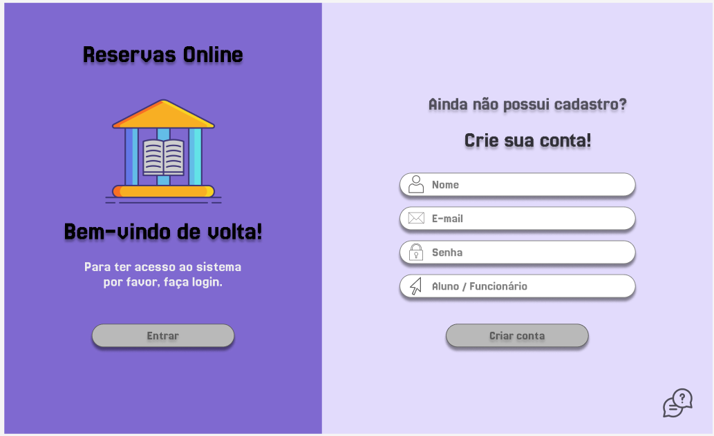
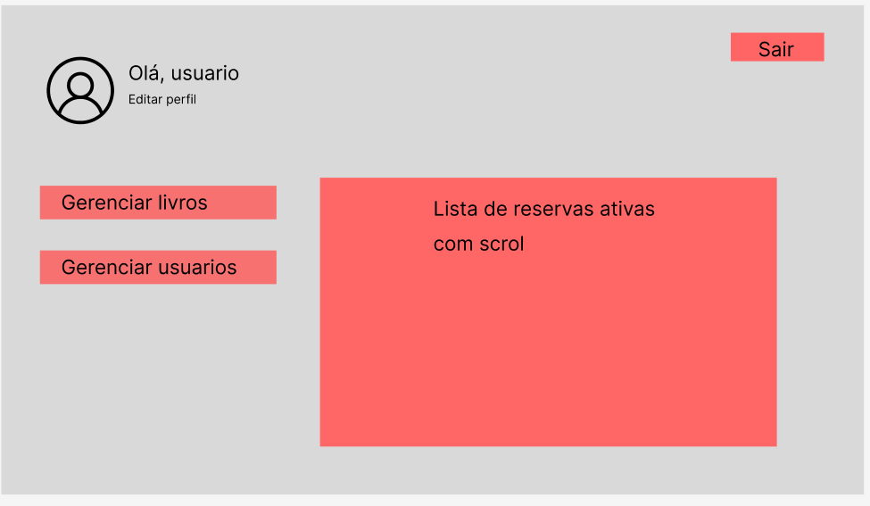
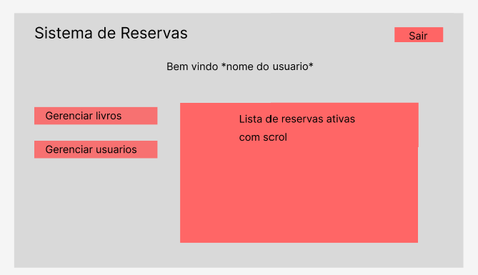

# Empréstimos e Reservas de Materiais da Biblioteca

## 1) Problema
Em uma realidade alternativa, os alunos precisam diariamente de livros para acompanhar suas aulas.  
Na turma de **Desenvolvimento Web** existem **42 alunos** e apenas **13 exemplares emprestáveis** do livro *“Lógica de Programação e Algoritmos com JavaScript”*.  
Para que todos consigam utilizá-lo, é necessário um sistema que organize a **rotatividade dos empréstimos**.

O objetivo é criar um **Sistema de Biblioteca Online** integrado ao portal *Minha Biblioteca* institucional.  
Alunos regularmente matriculados poderão **reservar e emprestar livros** de forma que haja sempre disponibilidade e controle do acervo.  
Não é necessário validar matrícula — o sistema já parte do princípio de que o aluno está cadastrado.

---

## 2) Atores e Decisores
- **Usuários principais:** Alunos regularmente matriculados, Bibliotecários  
- **Decisores/Apoiadores:** Bibliotecários (gestão do acervo e regras de empréstimo)

---

## 3) Casos de Uso
**Todos:**  
- Logar e deslogar no sistema  
- Alterar foto de perfil

**Aluno:**  
- Pesquisar livros e ver quantos exemplares estão disponíveis, assim como descrição, título, etc  
- Fazer **reserva** para retirar livro na biblioteca quando tiver exemplares disponíveis  

**Bibliotecário:**  
- Atualizar quantidade de exemplares no acervo  
- Registrar empréstimos e finalizações, atualizando status do material
- Registrar usuários (Funcionários, alunos)

---

## 4) Limites e Suposições
- O aluno pode **emprestar apenas um exemplar de cada material** por vez e ficar com ele e fazer renovações.  
- Devolução pode ser feita a qualquer momento, garantindo a rotatividade.  
- Caso ultrapasse o limite de renovações, o aluno fica **impedido de renovar o livro**.

---

## 5) Hipóteses e Validação (exemplo)
- A validação é feita por meio de tokens, sendo necessário fazer login novamente caso expire.

---

## 6) Fluxo Principal

## Fluxo do Sistema e Funcionalidades

### Aluno
- O **aluno faz login** no sistema.  
- Após o login, a **tela principal** é a **HomeAluno**, onde ele pode:  
  - Visualizar suas **reservas ativas**.  
  - Renovar ou cancelar reservas existentes.  
  - Acessar o **catálogo de livros**, onde pode:  
    - Pesquisar livros por título.  
    - Visualizar detalhes do livro (autor, descrição, exemplares disponíveis).  
    - Realizar uma **reserva** de livros disponíveis.

---

### Funcionário
- O **funcionário faz login** no sistema.  
- A **HomeFuncionario** exibe todas as **reservas do sistema**.  
- A partir da tela principal, ele pode acessar:  

1. **Gerenciamento de usuários:**  
   - Visualizar todos os usuários.  
   - Atualizar dados de usuários existentes.  
   - Adicionar novos usuários.  

2. **Gerenciamento de livros:**  
   - Visualizar todos os livros.  
   - Editar informações de livros existentes.  
   - Adicionar novos livros ao catálogo.  

- Na tela de reservas, o funcionário também pode:  
  - Marcar reservas como **finalizadas**.  
  - **Cancelar** reservas.  
  - **Excluir** reservas do banco, se necessário.

---

## 7) Esboços de Telas
**Tela de Login**

**Tela Home**




---

## 8) Tecnologias

### 8.1 Navegador
- **Front-end:** React com Vite, Bootstrap para estilização
- **Armazenamento local:** LocalStorage (para sessão ou dados temporários)
- **Hospedagem:** Render

### 8.2 Back-end
- **Servidor/API:** Node.js com Express  
- **Banco de dados:** PostgreSQL 
- **Deploy:** Render

---

## 9) Plano de Dados

### 9.1 Entidades
- **Usuario** — representa alunos e bibliotecários  
- **Livro** — representa um título no acervo  
- **Emprestimo** — registra o empréstimo de um exemplar a um usuário  
- **Reserva** — Representa a reserva de um exemplar

### 9.2 Campos por Entidade

**Usuario**

| Campo | Tipo   | Obrigatório | Exemplo                                     | Observações                      |
| ----- | ------ | ----------- | ------------------------------------------- | -------------------------------- |
| id    | número | sim         | 1                                           | Chave primária, autoincrement    |
| nome  | texto  | sim         | "Ana Souza"                                 | Nome completo do usuário         |
| email | texto  | sim (único) | "[ana@exemplo.com](mailto:ana@exemplo.com)" | Deve ser único no sistema        |
| tipo  | char   | sim         | 'aluno' / 'funcionario'                     | Define se é aluno ou funcionário |
| foto  | texto  | não         | "/uploads/default/perfil.png"               | Caminho da foto do usuário       |


**Livro**

| Campo              | Tipo   | Obrigatório | Exemplo                           | Observações                           |
| ------------------ | ------ | ----------- | --------------------------------- | ------------------------------------- |
| id                 | número | sim         | 101                               | Chave primária, autoincrement         |
| titulo             | texto  | sim         | "Lógica de Programação"           | Título do livro                       |
| autor              | texto  | sim         | "José da Silva"                   | Autor do livro                        |
| patrimonio         | texto  | não         | "P003"                            | Código de patrimônio do livro         |
| total_copias       | número | sim         | 7                                 | Total de exemplares disponíveis       |
| copias_disponiveis | número | sim         | 5                                 | Quantidade disponível para empréstimo |
| descricao          | texto  | não         | "Livro de lógica para iniciantes" | Descrição opcional                    |


**Empréstimo**

| Campo       | Tipo      | Obrigatório | Exemplo          | Observações                         |
| ----------- | --------- | ----------- | ---------------- | ----------------------------------- |
| id          | número    | sim         | 1                | Chave primária, autoincrement       |
| id_usuario  | número fk | sim         | 1                | FK para `usuario.id`                |
| id_livro    | número fk | sim         | 101              | FK para `livro.id`                  |
| data_inicio | timestamp | sim         | 2025-09-11 14:35 | Data e hora do início do empréstimo |
| data_fim    | timestamp | sim         | 2025-09-12 14:35 | Data e hora do término previsto     |
| devolvido   | booleano  | sim         | false            | TRUE se o livro foi devolvido       |

**Reserva**

| Campo        | Tipo      | Obrigatório | Exemplo                                          | Observações                       |
| ------------ | --------- | ----------- | ------------------------------------------------ | --------------------------------- |
| id           | número    | sim         | 5                                                | Chave primária, autoincrement     |
| id_usuario   | número fk | sim         | 1                                                | FK para `usuario.id`              |
| id_livro     | número fk | sim         | 101                                              | FK para `livro.id`                |
| data_reserva | timestamp | sim         | 2025-09-11 10:00                                 | Data/hora que a reserva foi feita |
| status       | char      | sim         | 'A' (ativa) / 'C' (concluída) / 'F' (finalizada) | Status atual da reserva           |
| renovacoes   | número    | sim         | 0                                                | Número de renovações realizadas   |


### 9.3 Relações

**Diagrama Lógico**

Usuario (1) ───< Emprestimo (N)
Usuario (1) ───< Reserva (N)

Livro (1) ───< Emprestimo (N)
Livro (1) ───< Reserva (N)

**Detalhamento**

- Um **Usuario** pode ter muitos **Emprestimos** e muitas **Reservas** (1 → N)  
- Um **Livro** pode ter muitos **Emprestimos** e muitas **Reservas** (1 → N)  
- Cada **Emprestimo** pertence a um **Usuario** e a um **Livro** (N → 1)  
- Cada **Reserva** pertence a um **Usuario** e a um **Livro** (N → 1)

# Script do Banco de dados:

## Tabelas

```sql
-- =======================
-- Tabela usuário
-- =======================
CREATE SEQUENCE public.usuario_id_seq
    AS integer
    START WITH 1
    INCREMENT BY 1;

CREATE TABLE public.usuario (
    id integer NOT NULL DEFAULT nextval('public.usuario_id_seq'::regclass),
    nome character varying(100) NOT NULL,
    email character varying(100) NOT NULL UNIQUE,
    senha text NOT NULL,
    tipo character varying(100) NOT NULL CHECK (tipo IN ('aluno', 'funcionario')),
    foto text DEFAULT '/uploads/default/perfil.png',
    CONSTRAINT usuario_pkey PRIMARY KEY (id)
);

-- ======================
-- Tabela livro
-- ======================
CREATE SEQUENCE public.livro_id_seq
    AS integer
    START WITH 1
    INCREMENT BY 1;

CREATE TABLE public.livro (
    id integer NOT NULL DEFAULT nextval('public.livro_id_seq'::regclass),
    titulo character varying(225) NOT NULL,
    autor character varying(225) NOT NULL,
    patrimonio character varying(50),
    total_copias integer CHECK (total_copias >= 0),
    copias_disponiveis integer CHECK (copias_disponiveis >= 0 AND copias_disponiveis <= total_copias),
    descricao text,
    CONSTRAINT livro_pkey PRIMARY KEY (id)
);

-- =====================
-- Tabela reserva
-- =====================
CREATE FUNCTION public.limitar_renovacoes() RETURNS trigger
    LANGUAGE plpgsql
AS $$
BEGIN
    IF NEW.renovacoes > 3 THEN
        RAISE EXCEPTION 'Limite máximo de 3 renovações atingido.';
    END IF;
    RETURN NEW;
END;
$$;

CREATE SEQUENCE public.reserva_id_seq
    AS integer
    START WITH 1
    INCREMENT BY 1;

CREATE TABLE public.reserva (
    id integer NOT NULL DEFAULT nextval('public.reserva_id_seq'::regclass),
    id_livro integer NOT NULL REFERENCES public.livro(id) ON DELETE CASCADE,
    data_reserva timestamp without time zone DEFAULT CURRENT_TIMESTAMP,
    status character varying(200) DEFAULT 'ativa',
    id_usuario integer NOT NULL REFERENCES public.usuario(id) ON DELETE CASCADE,
    data_devolucao timestamp without time zone,
    renovacoes integer DEFAULT 0,
    CONSTRAINT reserva_pkey PRIMARY KEY (id)
);

CREATE TRIGGER trigger_limite_renovacoes 
BEFORE UPDATE ON public.reserva
FOR EACH ROW EXECUTE FUNCTION public.limitar_renovacoes();

-- =====================
-- Inserindo Usuários
-- =====================
INSERT INTO usuario (nome, email, tipo, senha) VALUES
('Beatriz Santos', 'beatriz@exemplo.com', 'aluno', 'senha123'),
('Diego Oliveira', 'diego@exemplo.com', 'aluno', 'senha123'),
('Fernanda Costa', 'fernanda@exemplo.com', 'aluno', 'senha123'),
('Juliana Pereira', 'juliana@exemplo.com', 'aluno', 'senha123'),
('Marcelo Souza', 'marcelo@exemplo.com', 'funcionario', 'senha123');

-- =====================
-- Inserindo Livros
-- =====================
INSERT INTO livro (titulo, autor, total_copias, copias_disponiveis) VALUES
('JavaScript Avançado', 'Autor Desconhecido', 5, 5),
('Node.js para Iniciantes', 'Autor Desconhecido', 7, 7),
('React na Prática', 'Autor Desconhecido', 6, 6),
('Banco de Dados PostgreSQL', 'Autor Desconhecido', 4, 4),
('Git e GitHub para Devs', 'Autor Desconhecido', 8, 8);

-- =====================
-- Criando Reservas
-- =====================
INSERT INTO reserva (id_usuario, id_livro, data_reserva, data_devolucao, status, renovacoes)
VALUES 
(1, 2, now(), now() + INTERVAL '1 day', 'ativa', 0),
(2, 3, now(), now() + INTERVAL '1 day', 'ativa', 0),
(3, 4, now(), now() + INTERVAL '1 day', 'ativa', 0);


-- =============================================================
-- Atualizar uma reserva quando o aluno vai buscar o livro
-- =============================================================
UPDATE reserva
SET status = 'ativa'
WHERE id = 1;

-- =============================================================
-- Atualizar uma reserva quando o aluno devolve o livro
-- =============================================================
UPDATE reserva
SET status = 'finalizada',
    data_devolucao = CURRENT_TIMESTAMP
WHERE id = 1;

-- =============================================================
-- Atualizar uma reserva quando o aluno ou funcionário cancela a reserva
-- =============================================================
UPDATE reserva
SET status = 'cancelada',
    data_devolucao = CURRENT_TIMESTAMP  -- opcional, caso queira registrar a data
WHERE id = 1;


